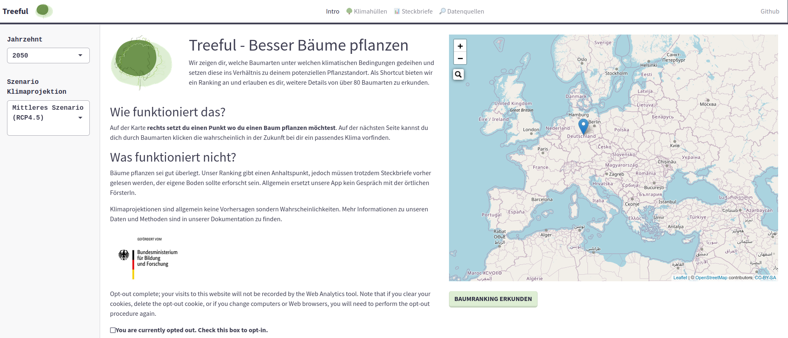
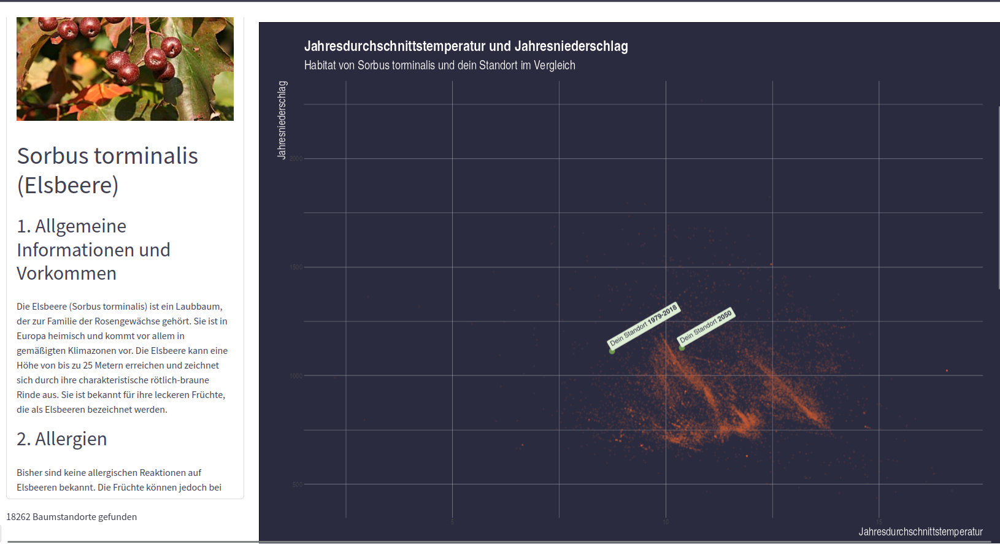
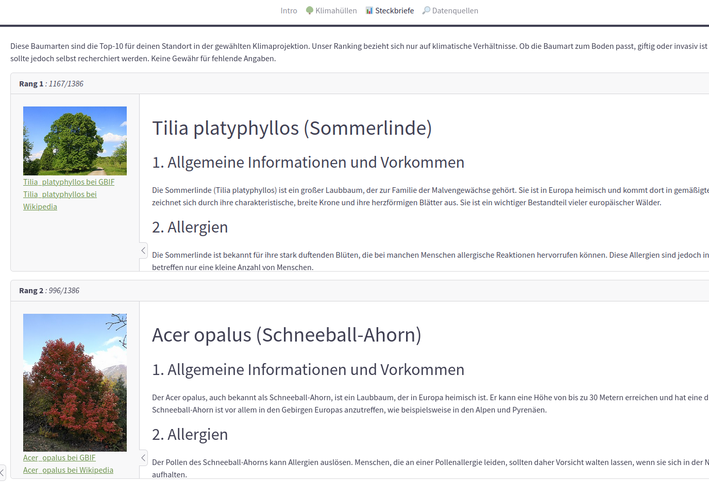

<!-- README.md is generated from README.Rmd. Please edit that file -->

```{r, include = FALSE}
knitr::opts_chunk$set(
  collapse = TRUE,
  comment = "#>",
  fig.path = "man/figures/README-",
  out.width = "100%"
)
```

# treeful

<!-- badges: start -->
[](https://lifecycle.r-lib.org/articles/stages.html#experimental)
<!-- badges: end -->

The goal of treeful is to ...

## Installation

This shiny app is developed as R package. Installing by itself will not be of much use, the entire ETL pipeline needs to be run first for all tree occurrence data points. See [our docs](https://docs.treeful.de) for more info. 




 




