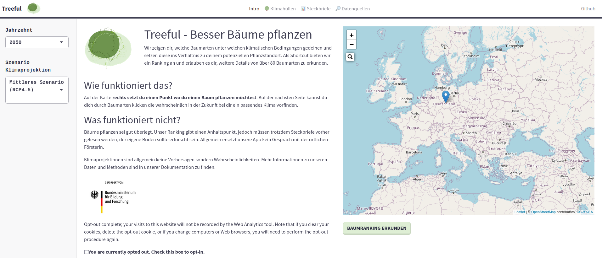
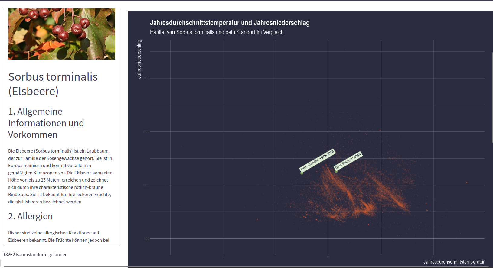
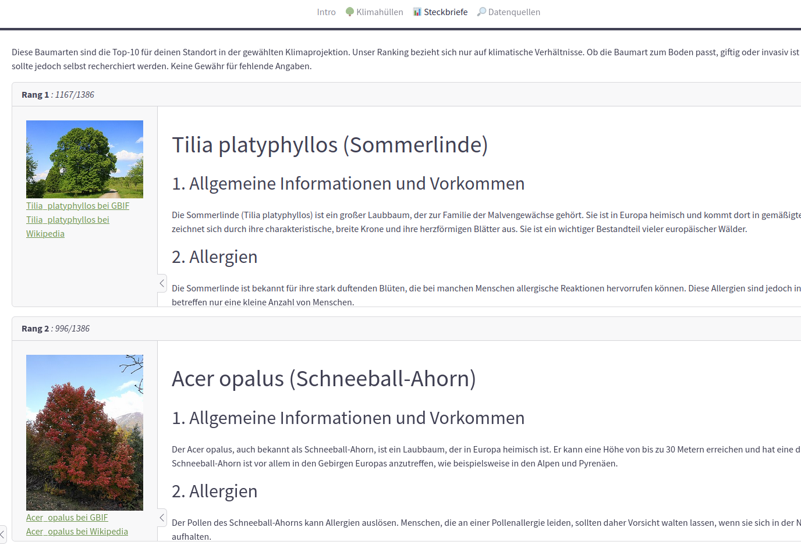
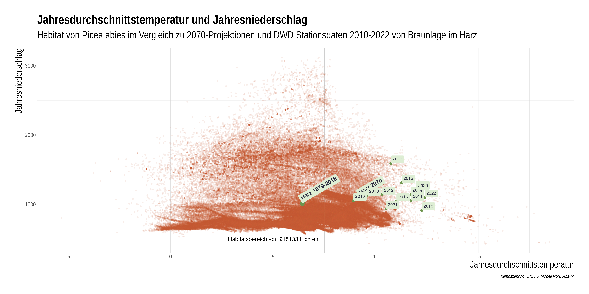

<!-- README.md is generated from README.Rmd. Please edit that file -->

# treeful

<!-- badges: start -->

<!-- badges: end -->

## Installation

This shiny app is developed as R package. Installing by itself will not
be of much use, the entire ETL pipeline needs to be run first for all
tree occurrence data points. See [our docs](https://docs.treeful.de) for
more info.

