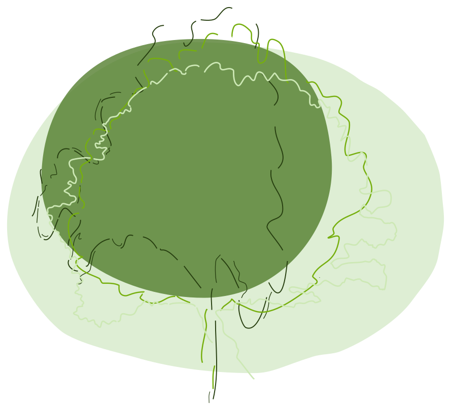

# Treeful - Make Tree Planting Future-proof 

This repo contains the code for [Treeful](https://treeful.de), an ETL pipeline and Shiny app to help people plant trees, taking climate change realities into account. 

## Structure

* 1_ETL: contains the main R scripts to fetch millions of tree locations, clean names, extract raster data from Copernicus CDS projection files, enhance tree species with 
* 2_docs: our Quarto book, documenting some of th decisions taken and functions used. 
* 3_shiny_frontend: the shiny app developed as Golem and deployed on our own shiny server. 

## Funding

Sponsored through the Prototype Fund by the German Federal Ministry of Education and Research from March 2023 to September 2023. 

